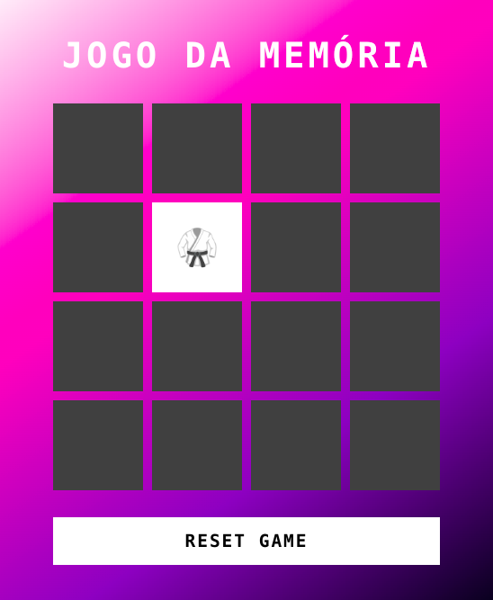

<h1 align="center">Memory Game</h1>

  
  

  

## 🎯 Projeto

Criação de um jogo da memória utilizando `HTML`, `CSS` e `JAVASCRIPT`

- [Play Game](https://leoviana00.github.io/dio-dp-memory-game-javascript/)

## 👨‍💻 Tecnicas

- Manipulação de dom
- Criação dos cards de forma dinâmica
- Rotate dos cards
- Desenho de logica através do css e javascript
- cssgradient.io
- Just Color Picker

## 📄 Referência

- [CSS Gradient](https://cssgradient.io/)
- [Color Picker](https://annystudio.com/software/colorpicker/)
- [Manipulação de DOM](https://developer.mozilla.org/pt-BR/docs/Web/API/Document_Object_Model/Introduction)